### file Strcuture

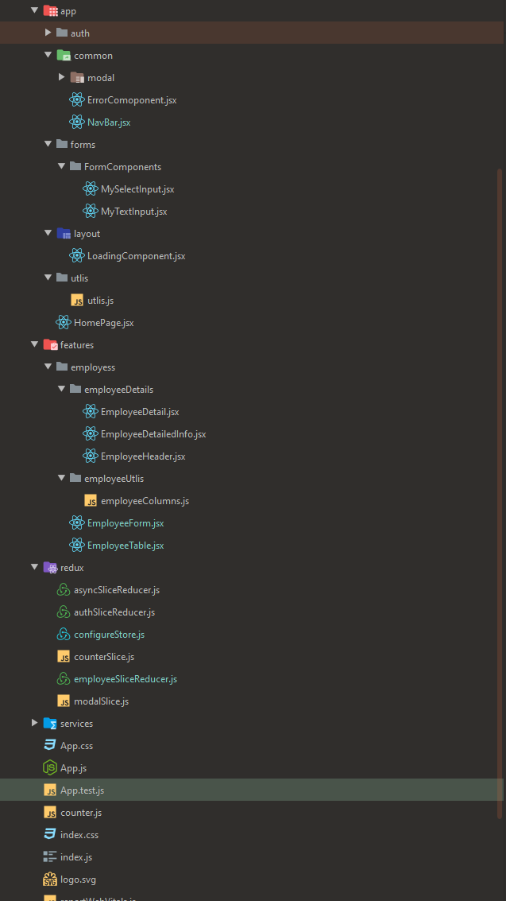
### Dependencies 
- [Sematic Ui react](hhttps://react.semantic-ui.com)
- [Redux Toolkit](https://redux-toolkit.js.org)
- [Material Table](https://material-table.com/#/)
- [Toastr](https://codeseven.github.io/toastr/#:~:text=toastr%20is%20a%20Javascript%20library,Growl%20type%20non-blocking%20notifications.&text=The%20goal%20is%20to%20create,can%20be%20customized%20and%20extended.)

### HomePage

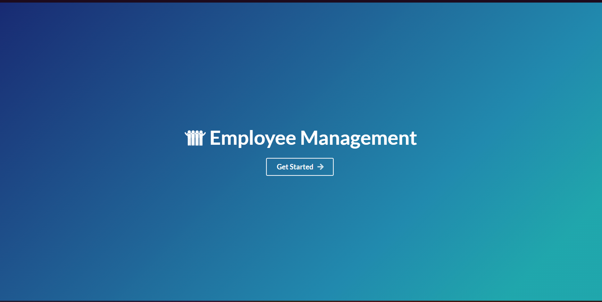

### Employee Table for crud operation

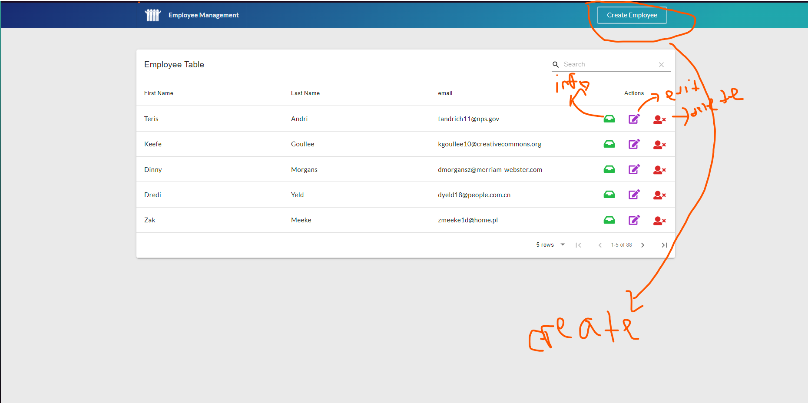

### info page

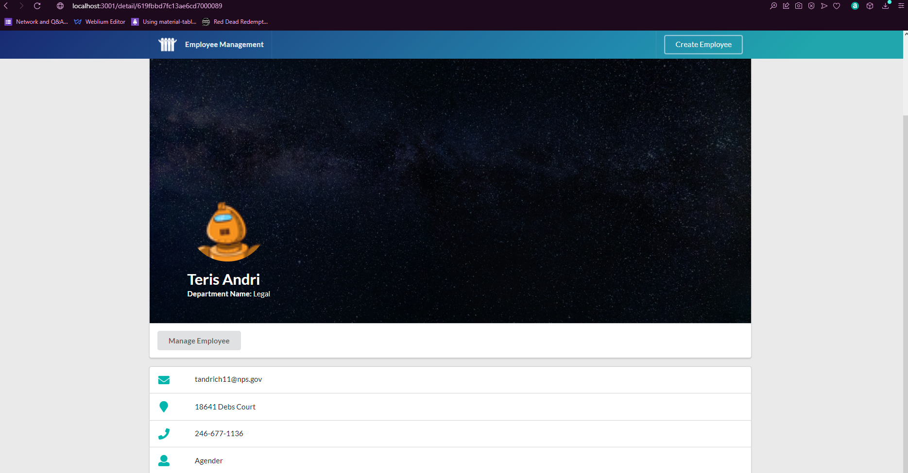

- find the info based on ID of the user.

### Editing Employee

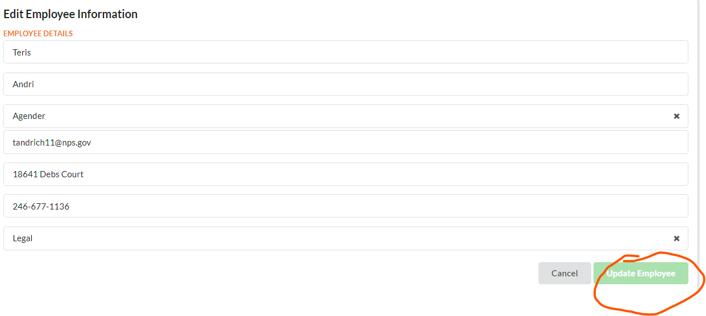

- button is disabled cause no changes was done.

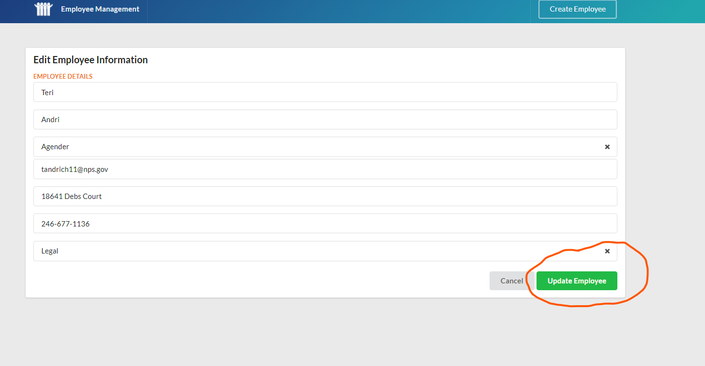

- button is no longer blocked here.

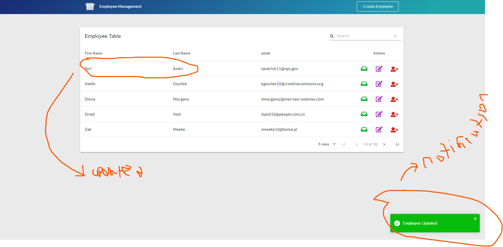

### deleting employee

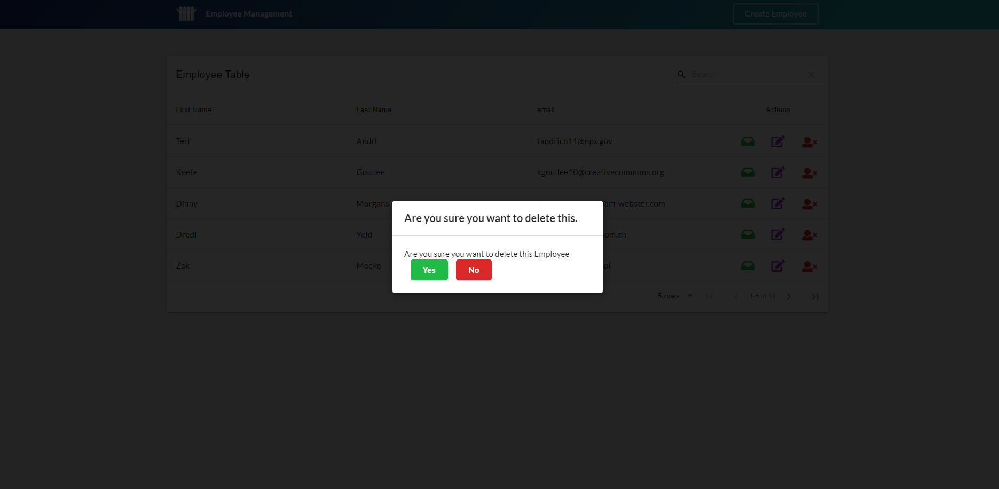

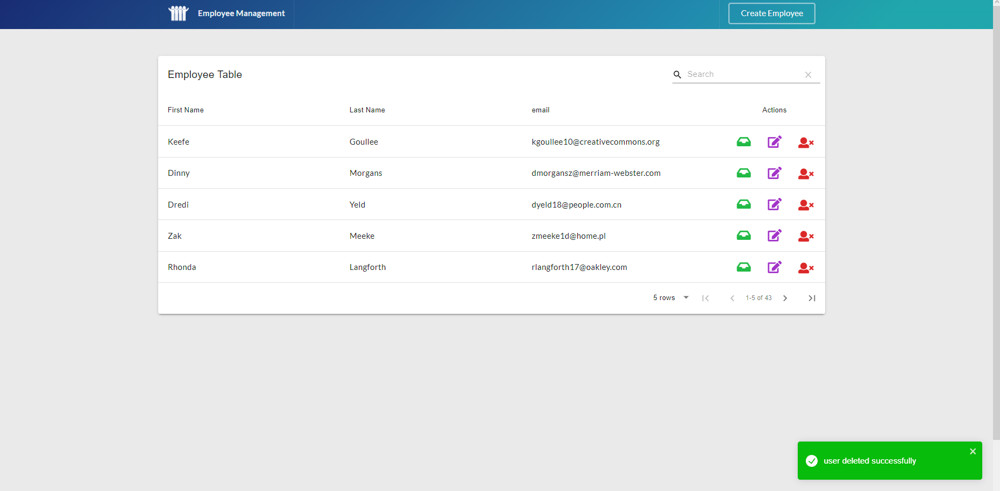

- Employee has been deleted 
### creating Employee

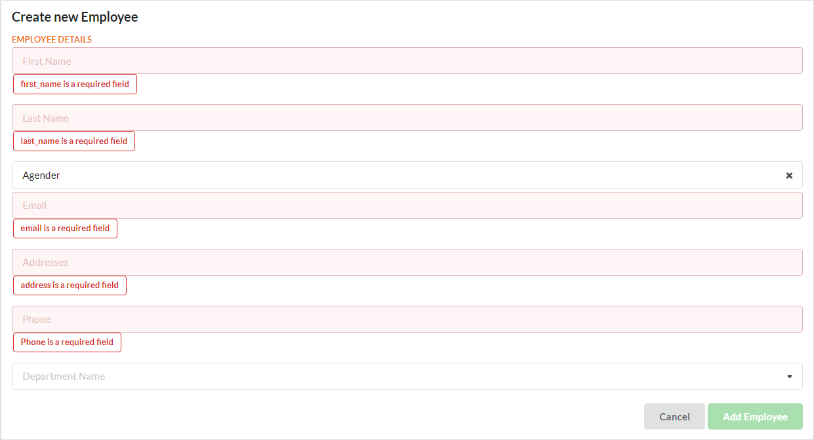
added validation

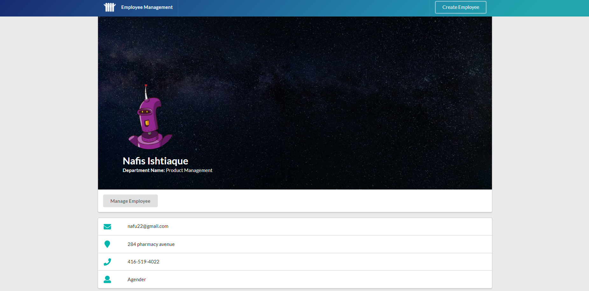
- emolyee has been created 
- 